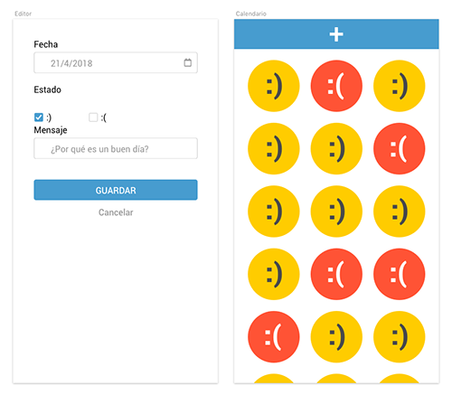

#  Life Calendar
Crear un calendario en el que cada día se va apuntado qué tal ha ido el día eligiendo un smiley

## Especificaciones
**Se desarrollará una web-app con las siguientes características:**
- Solo hay dos opciones, día bueno o día malo: :) ó :(
- En el caso de un buen día, :), se podrá añadir un mensaje
- Una vez guardado un día ya no se puede editar
- Hay dos vistas, la vista de edición y la del listado de días
- Se accede al editor con el botón + que aparece fijo en la parte superior de la pantalla
- Los botones guardar/cancelar devuelven a la vista de listado
- Los datos se guardarán en el local storage del navegador
